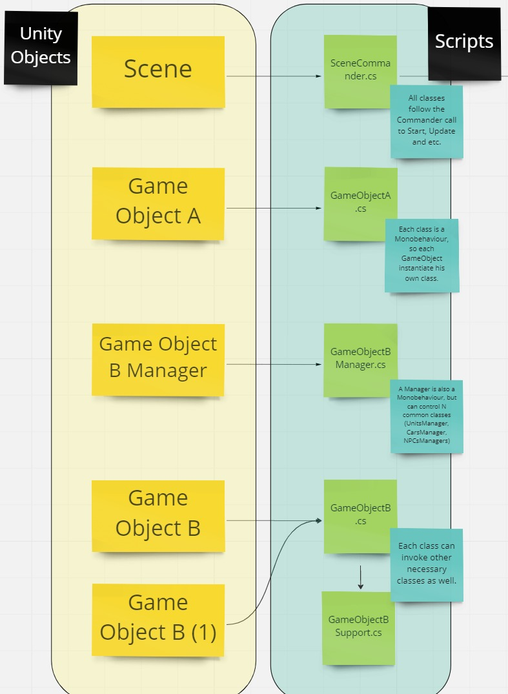

# Project T

## **tl;dr**

Project T is [IN PROGRESS WORK] to build my own base project for new games made with Unity. It has the structure I like to use and my code style. I'm using here some famous game design patterns, like singletons, commanders, state machines, etc.

## **architecture**

Games in [Unity](https://docs.unity3d.com/Manual/index.html) can be split into many [Scenes](https://docs.unity3d.com/Manual/CreatingScenes.html), so the idea here it's using that. I also refer to this [article here](https://bronsonzgeb.com/index.php/2021/04/24/unity-architecture-pattern-the-main-loop/) about the main loop, to avoid some weird stuff and keep more control. The image below shows how I think when building stuff in Unity.

#### **Commanders**

Each Scene has a single **Commander**, a [Monobehaviour](https://docs.unity3d.com/ScriptReference/MonoBehaviour.html) that runs the [Awake](https://docs.unity3d.com/ScriptReference/MonoBehaviour.Awake.html), [Start](https://docs.unity3d.com/ScriptReference/MonoBehaviour.Start.html) and [Update](https://docs.unity3d.com/ScriptReference/MonoBehaviour.Update.html) methods for each other class in that Scene. It's the only class in all scenes that actually uses these 3 Unity methods. For now, it is also responsible for general gameplay functions, like play or pause game.

#### **Controllers**

The **Commander** will control **Controllers**. **Controllers** (a Monobehaviour as well) is the name I gave to the most common game classes I have, responsible for all kinds of stuff that inflects in gameplay. It could be a system, like a timer or a spawner, or a gameplay thing, like an enemy or the player. **Controllers** can instantiate and attach to the main GameObject other **Controllers** when necessary (to extend functions, like a player can call a Controller Movement, Combat, etc.). If **Controller A** instantiate **Controller B** (creating a composition) it has the responsibility to control this new Controller as well.

#### **Managers**

When a **Controller** calls other **Controllers** that will be Game Objects, I start to name it as **Manager**. Ex: an EnemyManager could be a class that controls the spawn of new enemies.

#### **Non-monobehaviour classes**

There are also some non-monobehaviour classes to support the structure, like the FSM class and etc.

 

<!-- 

  

 

  
Table of Contents

  <ul>
    <li><a href="#-about-the-game"> About the game</a></li>
    <li><a href="#-how-to-play"> How to play</a></li>
    <li><a href="#-game-design"> Game design</a></li>
    <li><a href="#-game-development"> Game development</a></li>
    <li><a href="#-credits"> Credits</a></li>
  </ul>

 

<h2 id="#about-the-game"> About the game</h2>
Game description, to non-tech people and players in general.

 
 

<h2 id="#how-to-play"> How to play</h2>
Game tutorial, for everyone.

 
 

<h2 id="#game-design"> Game design</h2>
Game design ideas about the game, references and etc.

 
 

<h2 id="#game-development"> Game development</h2>
Game development ideas about the game, highlights and etc.
Created for Brackeys Game Jam 2022.1

 
 

<h2 id="#credits"> Credits</h2>
<a href="https://github.com/giovanemachado"> Giovane Machado</a> - game design and game development
 -->
